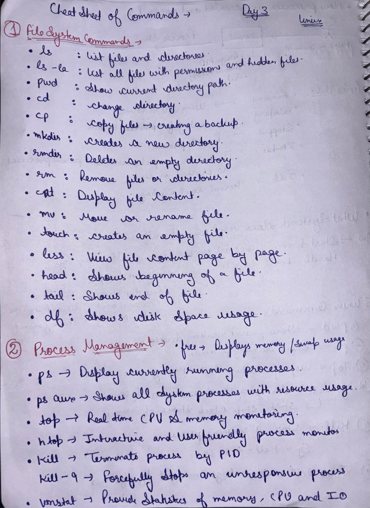
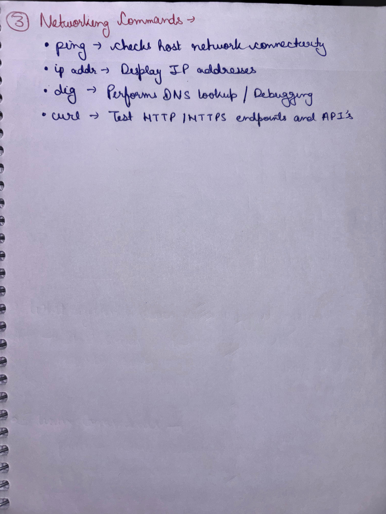

\# Day 03 – Linux Commands Practice

I practiced commonly used Linux commands related to:

\- File system management

\- Process management

\- Networking and basic troubleshooting

---

## 📸 Handwritten Linux Commands Cheat Sheet

### File System & Process Management

### Networking Commands

\## ✅ Status

Day 03 task completed successfully.

