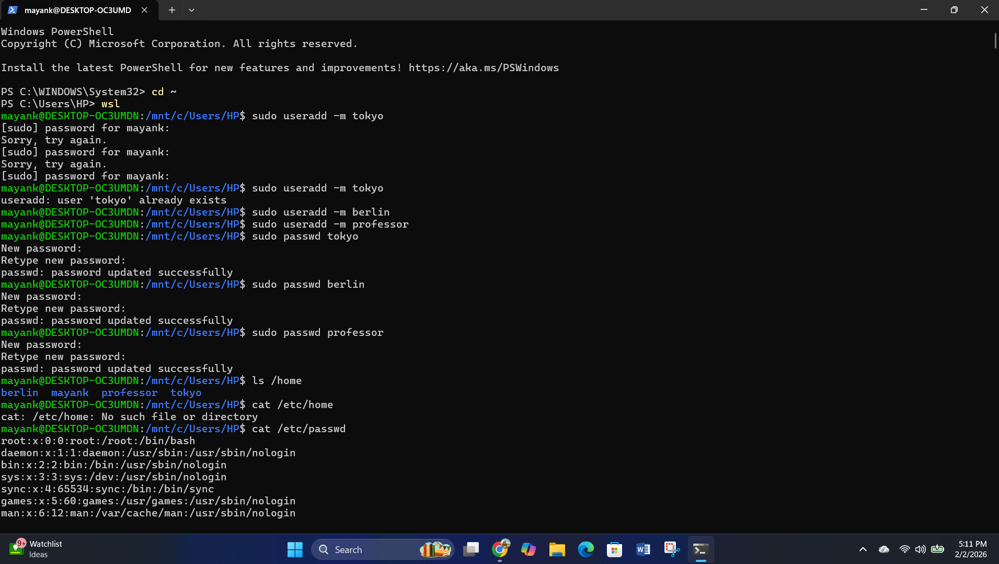
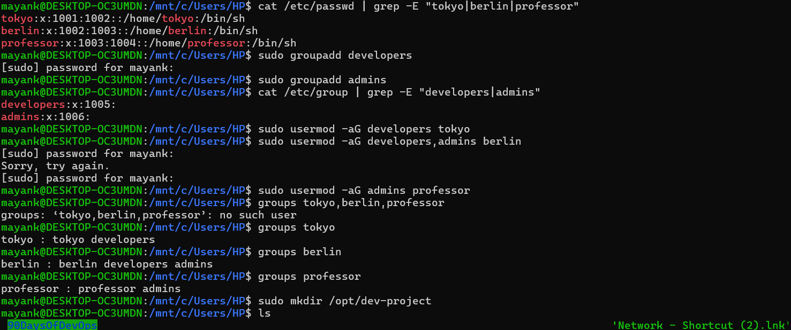
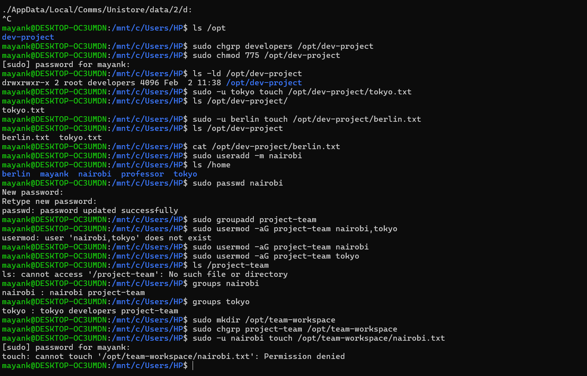

# Day 09 – Linux User & Group Management Challenge

## 📌 Objective
Practice Linux user and group management by creating users, groups, assigning permissions, and validating shared access — a core DevOps skill.

---

## 👤 Users & Groups Created

### Users
- tokyo
- berlin
- professor
- nairobi

### Groups
- developers
- admins
- project-team

---

## 👥 Group Assignments

| User       | Groups Assigned                  |
|------------|----------------------------------|
| tokyo      | developers, project-team         |
| berlin     | developers, admins               |
| professor  | admins                           |
| nairobi    | project-team                     |

---

## 📁 Shared Directories & Permissions

| Directory              | Group Owner    | Permissions |
|------------------------|---------------|-------------|
| /opt/dev-project       | developers    | 775         |
| /opt/team-workspace    | project-team  | 775         |

**Permission Meaning (775):**
- Owner → Read, Write, Execute
- Group → Read, Write, Execute
- Others → Read, Execute

---

## 🧪 Verification Screenshots

- User & group creation output  
  

- Group membership verification  
  

- Shared directory permissions & file creation  
  

---

## 🧾 Commands Used (With Purpose)

```bash
# Create users with home directories
sudo useradd -m tokyo
sudo useradd -m berlin
sudo useradd -m professor
sudo useradd -m nairobi

# Set passwords
sudo passwd tokyo
sudo passwd berlin
sudo passwd professor
sudo passwd nairobi

# Create groups
sudo groupadd developers
sudo groupadd admins
sudo groupadd project-team

# Assign users to groups
sudo usermod -aG developers tokyo
sudo usermod -aG developers,admins berlin
sudo usermod -aG admins professor
sudo usermod -aG project-team nairobi
sudo usermod -aG project-team tokyo

# Verify group membership
groups tokyo
groups berlin
groups professor
groups nairobi

# Create shared directories
sudo mkdir /opt/dev-project
sudo mkdir /opt/team-workspace

# Set group ownership
sudo chgrp developers /opt/dev-project
sudo chgrp project-team /opt/team-workspace

# Set permissions
sudo chmod 775 /opt/dev-project
sudo chmod 775 /opt/team-workspace

# Test access as different users
sudo -u tokyo touch /opt/dev-project/tokyo.txt
sudo -u berlin touch /opt/dev-project/berlin.txt
sudo -u nairobi touch /opt/team-workspace/nairobi.txt


