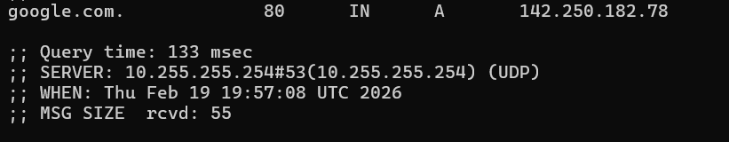
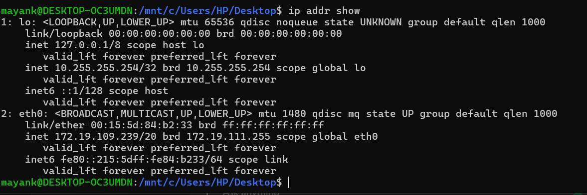
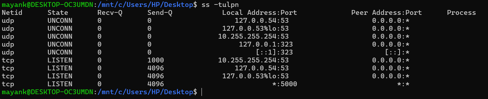

# Day 15 – Networking Concepts: DNS, IP, Subnets & Ports

---
## Hands on-

## 🔹 Task 1: DNS – How Names Become IPs

### ✔ What happens when you type google.com in a browser?

When we type a domain name, the browser asks the operating system for its IP address.  
If not cached, the request goes to a DNS resolver which queries root, TLD, and authoritative servers.  
The DNS server returns the IP address, and the browser connects to that server.

---

### ✔ DNS Record Types

A → Maps a domain to an IPv4 address  
AAAA → Maps a domain to an IPv6 address  
CNAME → Creates an alias from one domain to another  
MX → Specifies mail servers for a domain  
NS → Defines authoritative name servers for a domain  

---

### ✔ dig command output

google.com. 80 IN A 142.250.182.78

**A Record IP:** 142.250.182.78  
**TTL:** 80 seconds  

---

## 🔹 Task 2: IP Addressing

### ✔ What is IPv4?

IPv4 is a 32-bit numerical address written as four numbers separated by dots.  
Each number ranges from 0 to 255.  
Example: 192.168.1.10

---

### ✔ Public vs Private IP

Public IP → Accessible on the internet (example: 8.8.8.8)  
Private IP → Used inside local networks (example: 192.168.1.5)

---

### ✔ Private IP Ranges

10.0.0.0 – 10.255.255.255
172.16.0.0 – 172.31.255.255
192.168.0.0 – 192.168.255.255

---

### ✔ My IP from `ip addr show`

inet 172.19.109.239/20 brd 172.19.111.255 scope global eth0

This IP is **private** because it belongs to the 172.16–172.31 range.

---

## 🔹 Task 3: CIDR & Subnetting

### ✔ What does /24 mean?

/24 means the first 24 bits represent the network portion,  
and the remaining bits represent host addresses.

---

### ✔ Host calculation formula

Hosts = 2^(host bits) – 2

---

### ✔ Why do we subnet?

Subnetting divides a large network into smaller networks.  
It improves security, reduces broadcast traffic, and helps use IP addresses efficiently.

---

### ✔ CIDR Table

| CIDR | Subnet Mask       | Total IPs | Usable Hosts |
|------|-------------------|-----------|--------------|
| /24  | 255.255.255.0     | 256       | 254          |
| /16  | 255.255.0.0       | 65536     | 65534        |
| /28  | 255.255.255.240   | 16        | 14           |

---

## 🔹 Task 4: Ports – The Doors to Services

### ✔ What is a port?

A port is a logical communication endpoint that allows multiple services to run on the same machine using one IP address.

---

### ✔ Common Ports

| Port | Service |
|------|---------|
| 22   | SSH |
| 80   | HTTP |
| 443  | HTTPS |
| 53   | DNS |
| 3306 | MySQL |
| 6379 | Redis |
| 27017| MongoDB |

---

### ✔ Output from `ss -tulpn`

udp UNCONN 0 0 127.0.0.54:53 0.0.0.0:*
udp UNCONN 0 0 10.255.255.254:53 0.0.0.0:*
tcp LISTEN 0 4096 127.0.0.54:53 0.0.0.0:*
tcp LISTEN 0 4096 10.255.255.254:53 0.0.0.0:*
tcp LISTEN 0 4096 *:5000 :

**Matched Services:**

Port 53 → DNS service running  
Port 5000 → Likely a local application/web server  

---

## 🔹 Task 5: Putting It Together

### ✔ curl http://myapp.com:8080

DNS resolves the domain to an IP address.  
The request is sent to that IP, and port 8080 tells the OS which application should handle it.

---

### ✔ Database unreachable at 10.0.1.50:3306

First check network connectivity to the IP.  
Then verify firewall rules, routing, and whether MySQL is running on port 3306.

---

## 🔹 What I Learned (Key Points)

1. DNS converts domain names into IP addresses using hierarchical servers.  
2. CIDR and subnetting help structure and manage large networks efficiently.  
3. Ports allow multiple services to run on the same system without conflicts.

---

