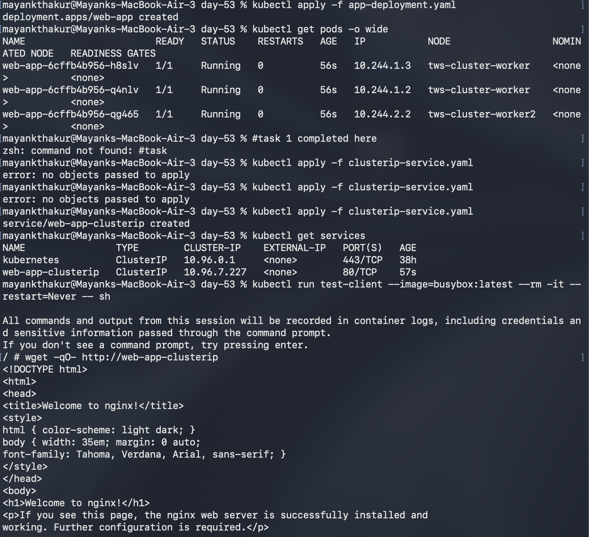
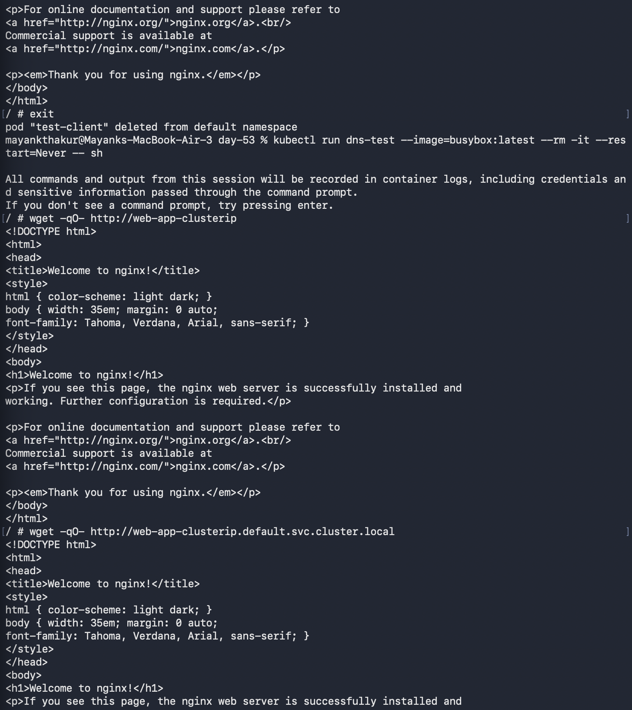
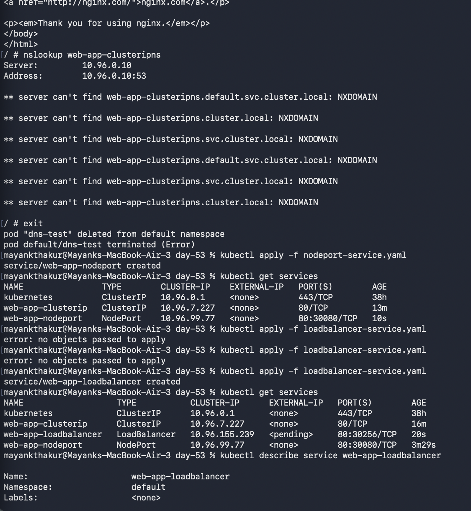
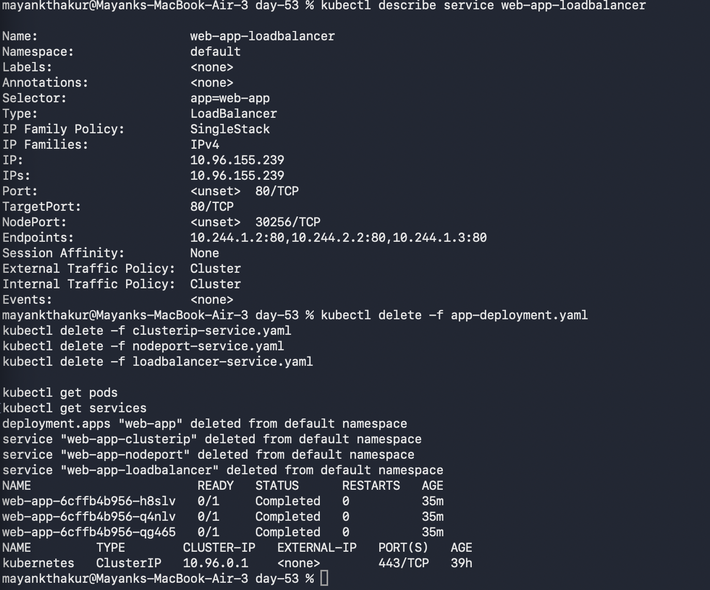

# Day 53 – Kubernetes Services
  
## 🚀 Objective

Understand how Kubernetes Services provide stable networking and load balancing for Pods.

---

## ❓ Why Services?

Pods have dynamic IP addresses that change when they restart.
A Service solves this by:

* Providing a **stable IP and DNS name**
* Load balancing traffic across multiple Pods

---

## 📦 Deployment

We created a Deployment with 3 replicas using Nginx.

```yaml
apiVersion: apps/v1
kind: Deployment
metadata:
  name: web-app
spec:
  replicas: 3
  selector:
    matchLabels:
      app: web-app
  template:
    metadata:
      labels:
        app: web-app
    spec:
      containers:
      - name: nginx
        image: nginx:1.25
        ports:
        - containerPort: 80
```

---

## 🔹 1. ClusterIP Service (Internal Access)

```yaml
apiVersion: v1
kind: Service
metadata:
  name: web-app-clusterip
spec:
  type: ClusterIP
  selector:
    app: web-app
  ports:
    - port: 80
      targetPort: 80
```

👉 **Explanation:**

* Default service type
* Accessible **only inside cluster**
* Used for internal communication

---

## 🔹 2. NodePort Service (External Access)

```yaml
apiVersion: v1
kind: Service
metadata:
  name: web-app-nodeport
spec:
  type: NodePort
  selector:
    app: web-app
  ports:
    - port: 80
      targetPort: 80
      nodePort: 30080
```

👉 **Explanation:**

* Exposes app on `<NodeIP>:30080`
* Used for testing and development
* Accessed via:

```
http://localhost:30080
```

---

## 🔹 3. LoadBalancer Service (Cloud Access)

```yaml
apiVersion: v1
kind: Service
metadata:
  name: web-app-loadbalancer
spec:
  type: LoadBalancer
  selector:
    app: web-app
  ports:
    - port: 80
      targetPort: 80
```

👉 **Explanation:**

* Used in cloud (AWS, GCP, Azure)
* Provides external IP
* In local cluster → shows `<pending>`

---

## 🔍 Service Types Comparison

| Type         | Access               | Use Case                 |
| ------------ | -------------------- | ------------------------ |
| ClusterIP    | Internal             | Pod-to-Pod communication |
| NodePort     | External via Node IP | Testing                  |
| LoadBalancer | External via cloud   | Production               |

---

## 🌐 Kubernetes DNS

Each service gets DNS:

```
web-app-clusterip.default.svc.cluster.local
```

👉 Can access using:

```
wget http://web-app-clusterip
```

---

## 🔗 Endpoints

Endpoints show which Pods a Service routes to.

Check:

```bash
kubectl get endpoints web-app-clusterip
```

👉 It lists Pod IPs connected to the service.

---

## 🧪 Verification

* All 3 Pods are running ✅
* ClusterIP works inside cluster ✅
* NodePort accessible via browser ✅
* LoadBalancer shows `<pending>` (expected locally) ✅

---

## 📸 Screenshot






---

## 🧹 Cleanup

```bash
kubectl delete -f app-deployment.yaml
kubectl delete -f clusterip-service.yaml
kubectl delete -f nodeport-service.yaml
kubectl delete -f loadbalancer-service.yaml
```

---

## 🧠 Key Learnings

* Services provide **stable networking**
* Load balancing across Pods
* DNS makes service discovery easy
* NodePort vs LoadBalancer difference is important for interviews

---

## 🔥 Conclusion

Kubernetes Services solve the problem of dynamic Pod IPs by providing a stable endpoint and load balancing.
Each service type is used based on accessibility needs.

---

#️⃣ #90DaysOfDevOps #Kubernetes #DevOps #Cloud
