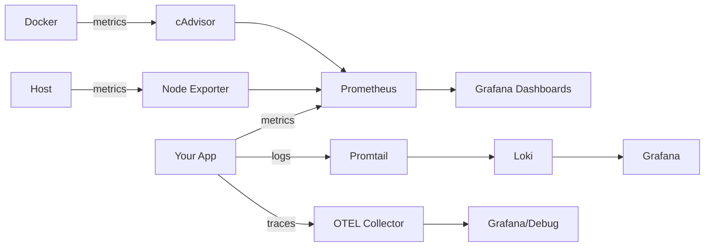

# Day 73: Introduction to Observability and Prometheus

## 1. The Three Pillars of Observability
Observability helps us understand the internal state of a system based on the data it produces. The three pillars are:
1. **Metrics:** These are numerical values measured over intervals of time (like CPU usage, request counts, or latency). They provide a high-level view of system health and help us detect *when* an issue happens.
2. **Logs:** These are immutable, timestamped text records of events that occurred. Logs are essential for debugging and understanding *why* a problem occurred, offering deep context like error messages or stack traces.
3. **Traces:** Tracing follows a single request as it travels across different microservices. It helps in identifying bottlenecks and tells us exactly *where* the issue or latency is within a distributed architecture.

## 2. Configuration Files

### `prometheus.yml`
```yaml
global:
  scrape_interval: 15s
  evaluation_interval: 15s

scrape_configs:
  - job_name: "prometheus"
    static_configs:
      - targets: ["localhost:9090"]

  - job_name: "notes-app"
    static_configs:
      - targets: ["notes-app:8000"]
```

### `docker-compose.yml`
```yaml
services:
  prometheus:
    image: prom/prometheus:latest
    container_name: prometheus
    ports:
      - "9090:9090"
    volumes:
      - ./prometheus.yml:/etc/prometheus/prometheus.yml
      - prometheus_data:/prometheus
    command:
      - '--config.file=/etc/prometheus/prometheus.yml'
    restart: unless-stopped

  notes-app:
    image: trainwithshubham/notes-app:latest
    platform: linux/amd64
    container_name: notes-app
    ports:
      - "8000:8000"
    restart: unless-stopped

volumes:
  prometheus_data:
```

## 3. Prometheus Targets

> *Note: Make sure to drop your screenshot here showing the targets! As we discovered, the `notes-app` will show as DOWN because the sample app doesn't natively expose Prometheus metrics on `/metrics`. This is expected per the tutorial's note.*

## 4. PromQL Queries

1. **How many metrics is Prometheus collecting about itself?**
   - **Query:** `count({__name__=~".+"})`
   - **Returned:** A single value (e.g., `855`) showing the total number of distinct time series available in the TSDB.

2. **Total HTTP requests to the Prometheus server:**
   - **Query:** `prometheus_http_requests_total`
   - **Returned:** A list of instant vectors (counters) broken down by HTTP handlers, status codes, and instances.

3. **Break it down by handler:**
   - **Query:** `prometheus_http_requests_total{handler="/api/v1/query"}`
   - **Returned:** Only the request count where the HTTP handler was specifically `/api/v1/query`.

4. **Per-second rate of HTTP requests over 5 minutes:**
   - **Query:** `rate(prometheus_http_requests_total[5m])`
   - **Returned:** The per-second growth rate of the HTTP request counters over the last 5 minutes.

5. **Per-second rate of non-200 HTTP requests over the last 5 minutes:**
   - **Query:** `rate(prometheus_http_requests_total{code!="200"}[5m])`
   - **Returned:** The per-second rate of requests that resulted in an error or redirect, effectively showing the error rate of the Prometheus server itself.

## 5. Counter vs Gauge

- **Counter:** A counter is a cumulative metric that represents a single monotonically increasing value. It can only increase or reset to zero on restart. It is typically used for tracking events.
  - *Example:* Total number of HTTP requests handled (`http_requests_total`), total number of errors, or total distance driven by a car.

- **Gauge:** A gauge is a metric that represents a single numerical value that can arbitrarily go up and down over time. It represents a snapshot of some current state.
  - *Example:* Current memory usage of a container (`process_resident_memory_bytes`), active concurrent connections, or the current speed of a car.

## 6. Architecture Diagram



### Explanation of TSDB Retention
**What happens when retention is exceeded?**
When the retention limit is reached (default 15 days or defined size), Prometheus will start deleting the oldest time-series data blocks to free up space for new data.

**Why is a volume mount important for Prometheus data?**
Because Prometheus is running in a Docker container, its internal file system is ephemeral. If the container is restarted or recreated without a volume, all the collected metrics in the TSDB would be lost. Mounting a persistent volume (`prometheus_data:/prometheus`) ensures your historical metrics survive container restarts.
