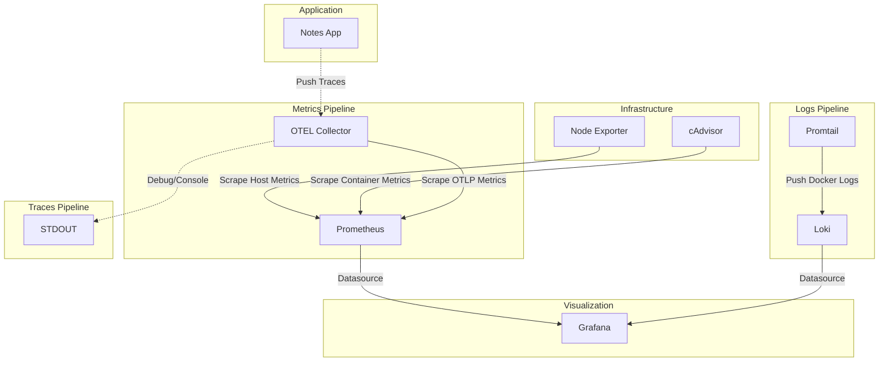

# Day 77 - Observability Project: Full Stack with Docker Compose

## Architecture Diagram



## Validation Screenshots

### 1. Prometheus Targets

*(Note: Please replace with actual screenshot of Prometheus Targets showing all jobs UP if available)*

### 2. Grafana Explore (Loki Logs)

*(Note: Please replace with actual screenshot of Grafana Explore showing logs from Loki)*

### 3. Production Overview Dashboard

*(Note: Please replace with actual screenshot of your "Production Overview" dashboard)*

### 4. OTEL Trace Debug Output

*(Note: Please replace with actual screenshot of OTEL trace in collector debug output)*

## Configuration Comparison

| Component | My Version (Days 73-76) | Reference Repo Version | Differences |
|-----------|--------------------------|-------------------------|-------------|
| `prometheus.yml` | Day 73-74 | Root directory | Reference includes `otel-collector` job, shorter intervals. |
| `loki-config.yml` | Day 75 | `loki/` directory | Reference has explicit retention and schema configs. |
| `promtail-config.yml` | Day 75 | `promtail/` directory | Uses docker pipeline stages. |
| `otel-collector-config.yml` | Day 76 | `otel-collector/` directory | Configures Prometheus exporter for metrics. |
| `datasources.yml` | Day 74 | `grafana/provisioning/` | Provisioned automatically via docker volumes. |
| `docker-compose.yml` | Days 73-76 | Root directory | Consolidates all 8 services into a single shared network (`monitoring`) with `unless-stopped` restart policy. |

## Production Readiness Enhancements

To take this observability stack to a production environment, I would add:
1. **Alertmanager**: For routing alerts to Slack, PagerDuty, or Email when incidents occur.
2. **Grafana Tempo / Jaeger**: For persistent trace storage (replacing the debug exporter).
3. **HTTPS/TLS**: Secure all endpoints (Prometheus, Grafana, Loki) with valid certificates to ensure encrypted transit.
4. **Authentication/Authorization**: Enforce strict RBAC on Grafana and basic auth/OAuth on Prometheus endpoints.
5. **Log Retention Policies**: Define retention limits in Loki to prevent running out of disk space over time.
6. **High Availability**: Run multiple replicas of Prometheus and Loki (via Ring topology) to ensure no single point of failure.

## Key Takeaways from the 5-Day Observability Block

- **Day 73**: Understood Prometheus fundamentals, metrics exposition, and querying via PromQL.
- **Day 74**: Monitored host and container environments with Node Exporter, cAdvisor, and built Grafana dashboards.
- **Day 75**: Mastered log aggregation using Loki and Promtail, writing LogQL queries, and connecting logs to metrics.
- **Day 76**: Got hands-on with OpenTelemetry (OTEL) Collector, instrumenting traces, and integrating basic alert concepts.
- **Day 77**: Integrated all individual components into a cohesive, production-style, single-pane-of-glass observability stack.

---

## Configuration Files

### `docker-compose.yml`
```yaml
version: '3.9'

networks:
  monitoring:
    driver: bridge

volumes:
  prometheus_data:
  grafana_data:
  loki_data:

services:
  grafana:
    image: grafana/grafana-enterprise
    container_name: grafana
    ports:
      - "3000:3000"
    volumes:
      - grafana_data:/var/lib/grafana
      - ./grafana/provisioning/datasources:/etc/grafana/provisioning/datasources
      - ./grafana/provisioning/dashboards:/etc/grafana/provisioning/dashboards
    networks:
      - monitoring
    restart: unless-stopped

  prometheus:
    image: prom/prometheus:latest
    container_name: prometheus
    ports:
      - "9090:9090"
    volumes:
      - prometheus_data:/prometheus
      - ./prometheus.yml:/etc/prometheus/prometheus.yml:ro
    networks:
      - monitoring
    restart: unless-stopped

  node-exporter:
    image: prom/node-exporter:latest
    container_name: node-exporter
    restart: unless-stopped
    volumes:
      - /proc:/host/proc:ro
      - /sys:/host/sys:ro
      - /:/rootfs:ro
    command:
      - --path.procfs=/host/proc
      - --path.rootfs=/rootfs
      - --path.sysfs=/host/sys
      - --collector.filesystem.mount-points-exclude=^/(sys|proc|dev|host|etc)($$|/)
    ports:
      - "9100:9100"
    networks:
      - monitoring

  cadvisor:
    image: gcr.io/cadvisor/cadvisor:latest
    container_name: cadvisor
    ports:
      - "8080:8080"
    volumes:
      - /:/rootfs:ro
      - /var/run/docker.sock:/var/run/docker.sock:ro
      - /sys:/sys:ro
      - /var/lib/docker:/var/lib/docker:ro
    networks:
      - monitoring
    restart: unless-stopped

  loki:
    image: grafana/loki:latest
    container_name: loki
    ports:
      - "3100:3100"
    volumes:
      - ./loki/loki-config.yml:/etc/loki/config.yaml:ro
      - loki_data:/loki
    command: -config.file=/etc/loki/config.yaml
    networks:
      - monitoring
    restart: unless-stopped

  promtail:
    image: grafana/promtail:latest
    container_name: promtail
    volumes:
      - ./promtail/promtail-config.yml:/etc/promtail/config.yaml:ro
      - /var/lib/docker/containers:/var/lib/docker/containers:ro
      - /var/run/docker.sock:/var/run/docker.sock
    command: -config.file=/etc/promtail/config.yaml
    depends_on:
      - loki
    networks:
      - monitoring
    restart: unless-stopped

  otel-collector:
    image: otel/opentelemetry-collector-contrib:latest
    container_name: otel-collector
    command: [ "--config=/etc/otelcol-contrib/config.yaml" ]
    volumes:
      - ./otel-collector/otel-collector-config.yml:/etc/otelcol-contrib/config.yaml:ro
    ports:
      - "4317:4317"
      - "4318:4318"
      - "8889:8889"
    networks:
      - monitoring
    restart: unless-stopped

  notes-app:
    image: notes-app:latest
    build:
      context: ./notes-app
      dockerfile: Dockerfile
    container_name: notes-app
    ports:
      - "8000:8000"
    networks:
      - monitoring
    restart: unless-stopped
```

### `prometheus.yml`
```yaml
global:
  scrape_interval: 15s
  evaluation_interval: 15s

scrape_configs:
  - job_name: "prometheus"
    static_configs:
      - targets: ["localhost:9090"]

  - job_name: "docker"
    static_configs:
      - targets: ["cadvisor:8080"]

  - job_name: "node-exporter"
    static_configs:
      - targets: ["node-exporter:9100"]

  - job_name: "otel-collector"
    static_configs:
      - targets: ["otel-collector:8889"]
```

### `loki-config.yml`
```yaml
auth_enabled: false

server:
  http_listen_port: 3100

common:
  ring:
    instance_addr: 127.0.0.1
    kvstore:
      store: inmemory
  replication_factor: 1
  path_prefix: /loki

schema_config:
  configs:
    - from: "2020-10-24"
      store: tsdb
      object_store: filesystem
      schema: v13
      index:
        prefix: index_
        period: 24h

storage_config:
  filesystem:
    directory: /loki/chunks
```

### `promtail-config.yml`
```yaml
server:
  http_listen_port: 9080

positions:
  filename: /tmp/positions.yaml

clients:
  - url: http://loki:3100/loki/api/v1/push

scrape_configs:
  - job_name: docker
    static_configs:
      - targets:
          - localhost
        labels:
          job: docker
          __path__: /var/lib/docker/containers/*/*-json.log
    pipeline_stages:
      - docker: {}
```

### `otel-collector-config.yml`
```yaml
receivers:
  otlp:
    protocols:
      grpc:
        endpoint: 0.0.0.0:4317
      http:
        endpoint: 0.0.0.0:4318

processors:
  batch: {}

exporters:
  prometheus:
    endpoint: 0.0.0.0:8889
  debug:
    verbosity: basic

service:
  pipelines:
    metrics:
      receivers: [otlp]
      processors: [batch]
      exporters: [prometheus]
    traces:
      receivers: [otlp]
      processors: [batch]
      exporters: [debug]
    logs:
      receivers: [otlp]
      processors: [batch]
      exporters: [debug]
```
